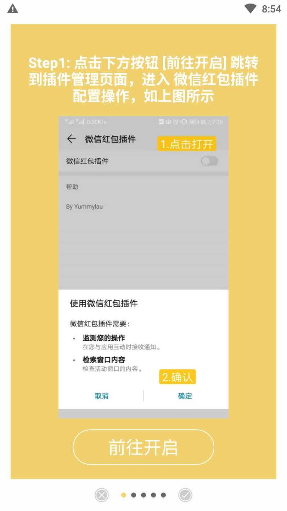
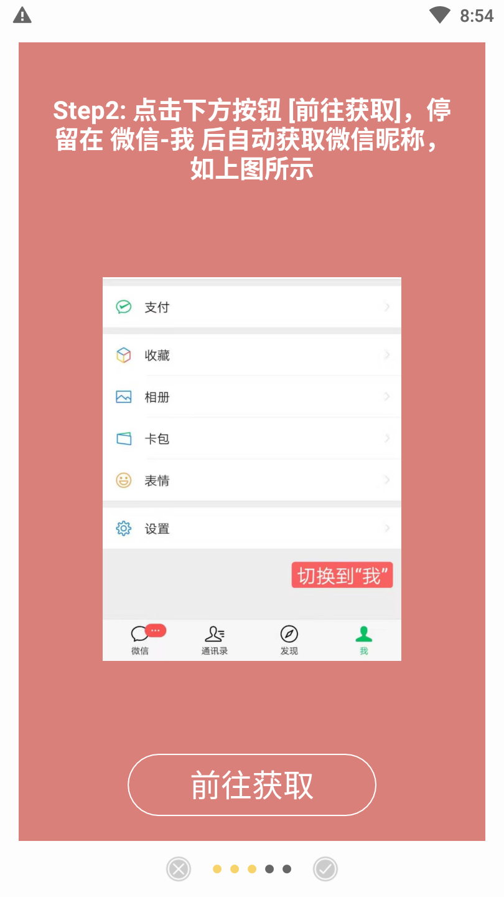
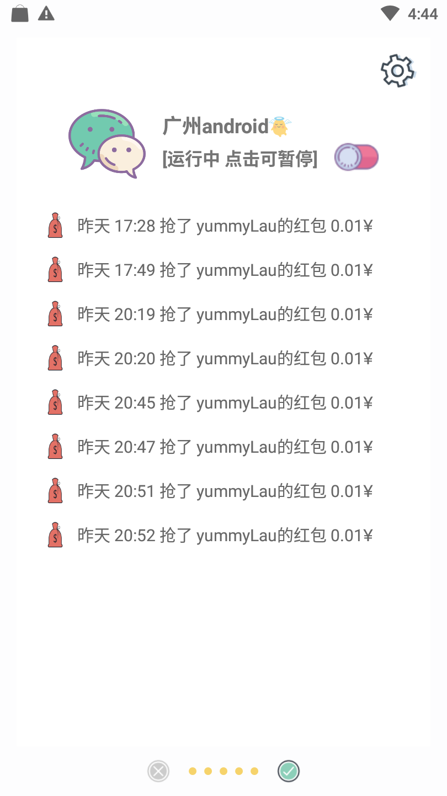
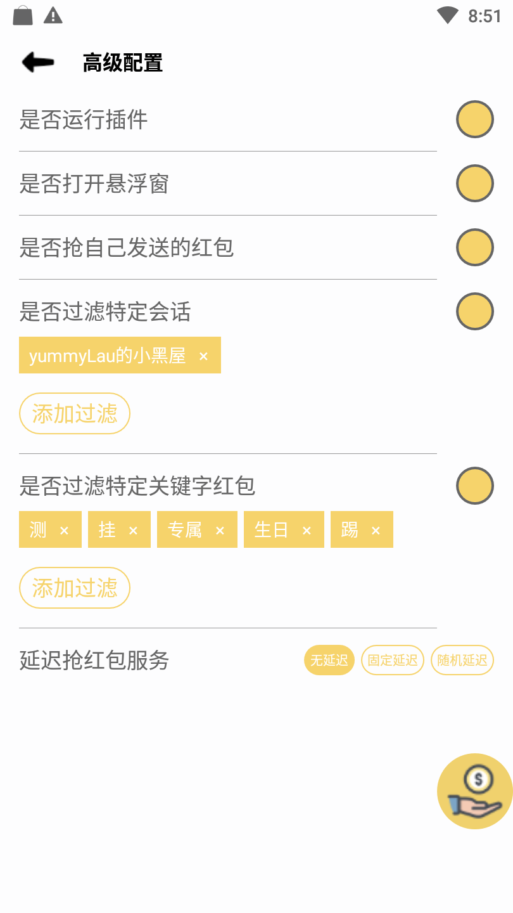
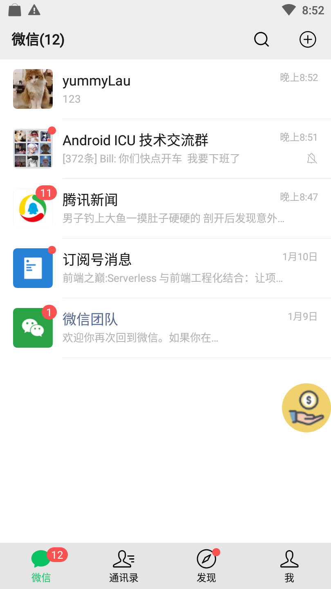
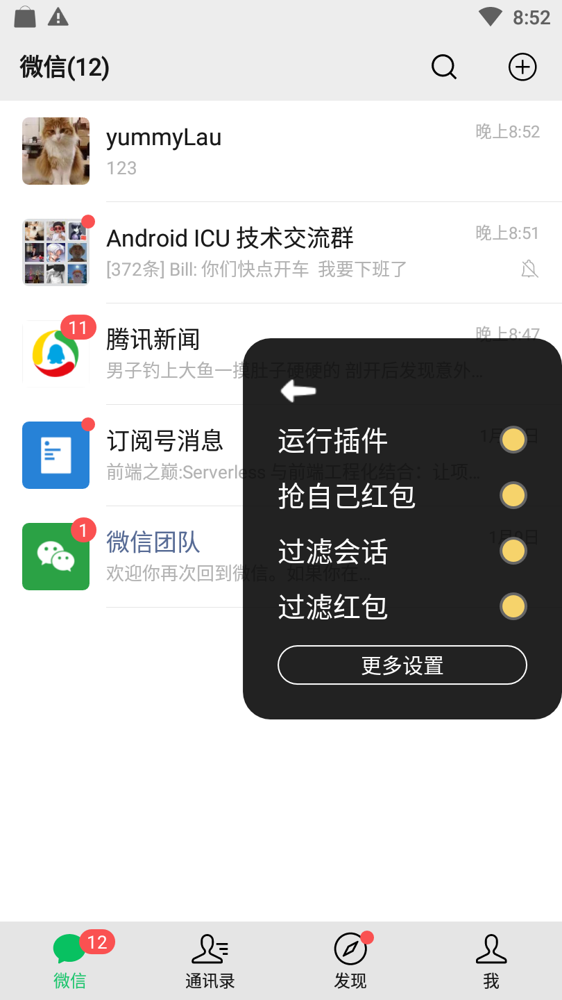

> 本工具是在实践 kotlin 语法中开发, 如果违反微信任何规则, 无条件删除。

### 微信红包小插件

> 免责申明，本应用仅仅作为测试学习使用，如应用于商业渠道而违反微信商业协议，后果自负。

**版本更新**

* 2019/01/01 - v1.0.0  支持微信 `7.0.0`, `7.0.3` 版本 支持是否抢自己红包，过滤红包特定关键字，延迟服务  
* 2020/01/10 - v1.0.1  支持微信 `7.0.10` 版本  
* 2020/01/14 - v1.0.2  支持过滤特定会话，悬浮窗.  
* 2020/01/16 - v1.0.3  支持通知栏
* 2020/01/17 - v1.0.4  优化打开红包速度，修复部分机型异常问题. 
* 2020/04/05 - v1.0.5  支持微信 `7.0.11`, `7.0.12`, `7.0.13` 微信版本，优化逻辑
* 2020/05/21 - v1.0.6  支持`7.0.14` 微信版本
* 2020/06/07 - v1.0.7  支持`7.0.15` 微信版本
* 2020/07/21 - v1.0.8  支持`7.0.16` 微信版本
* 2020/09/29 - v1.0.9  支持`7.0.17`,`7.0.18`,`7.0.19` 微信版本
* 2020/11/11 - v1.0.10  支持 `7.0.20` 微信版本
* 2021/01/07 - v1.0.11  支持 `7.0.21`, `7.0.22` 微信版本
* 2021/01/28 - v2.0.0  支持 `8.0.0` 微信版本
* 2021/02/10 - v2.1.0 适配 `8.0.1` 微信版本，由于微信可能静默升级版本，后续 8.x 默认不用专门适配，有问题 issue 反馈无法适配的版本。

**支持版本**

目前支持的微信版本：`7.0.0`, `7.0.3`,`7.0.10`-`7.0.22`，`8.0.1`，可能能够支持 8.x 后续版本。

**前置行为**

当且仅当用户满足前置条件时才能使用插件功能
* *开启模拟自动点击*
* *切到微信app上自动获取微信昵称*, 用于判断群聊消息是否时自己的。

大家请知悉“这个不是外挂，用的是无障碍助手提供的服务”。需要停留在微信界面才能使用，后续会考虑更新支持通知栏功能（实在抽不出太多时间），能用上就用吧。

> 另外，为了追求准确性，关闭私聊的抢红包功能，=。= 事实上也没有必要

版本更得比较急，功能若有瑕疵请多担待，如果有那么点帮助，不吝 star.

**支持的功能**

* 群聊是否需要抢自己发送的红包
* 支持过滤特定关键字, 默认有 `测`, `挂`, `专属`,`生日`,`踢` 等, 用户可自定义编辑
* 支持延迟服务, 自己控制抢红包的间隙时间
* 支持过滤特定会话，比如群聊、私聊等
* 支持悬浮窗（再也不用担心切来切去了）

**特别感谢**

[Stella](https://github.com/StellaSong12) 提供的 pr 功能
git
**下载二维码*

扫一扫下载最新apk

**效果展示**

未安装微信或者微信版本不支持

插件获取权限

获取微信昵称作为使用者标识

插件运行效果图

插件配置选项

悬浮窗场景

